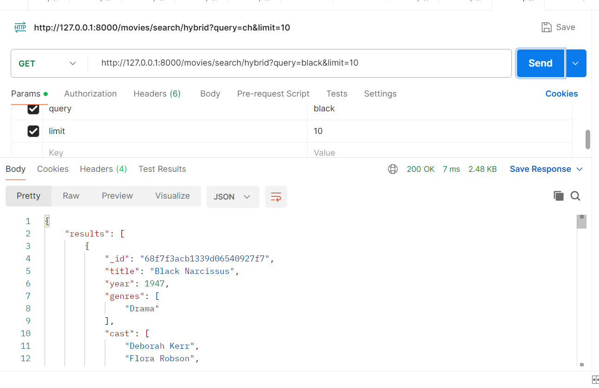
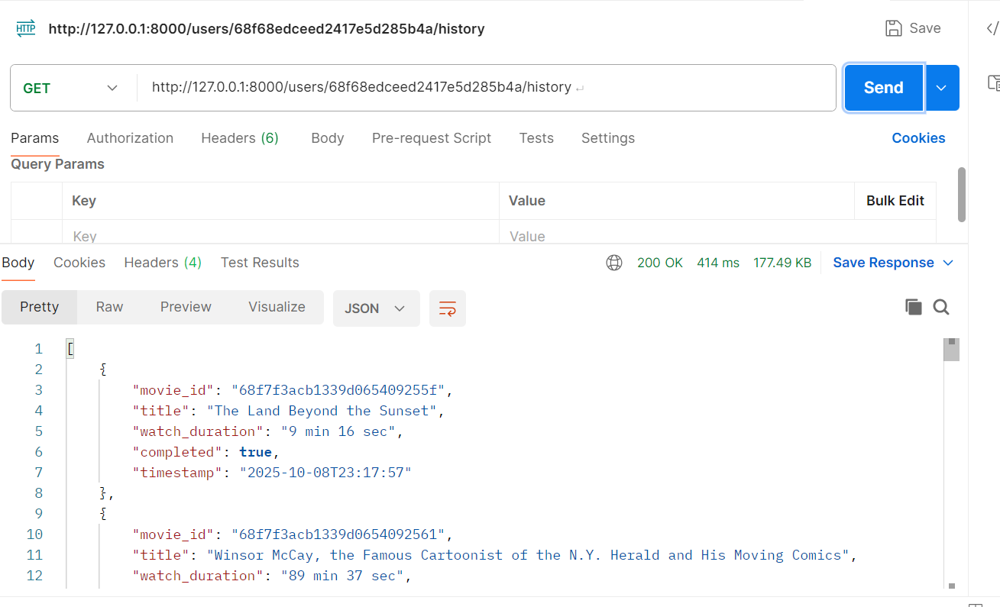
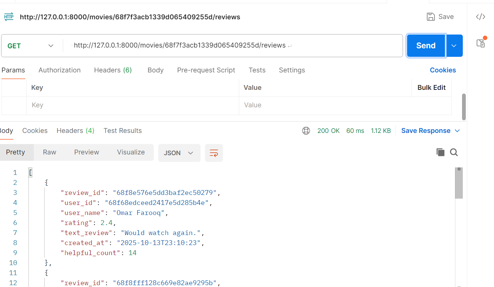
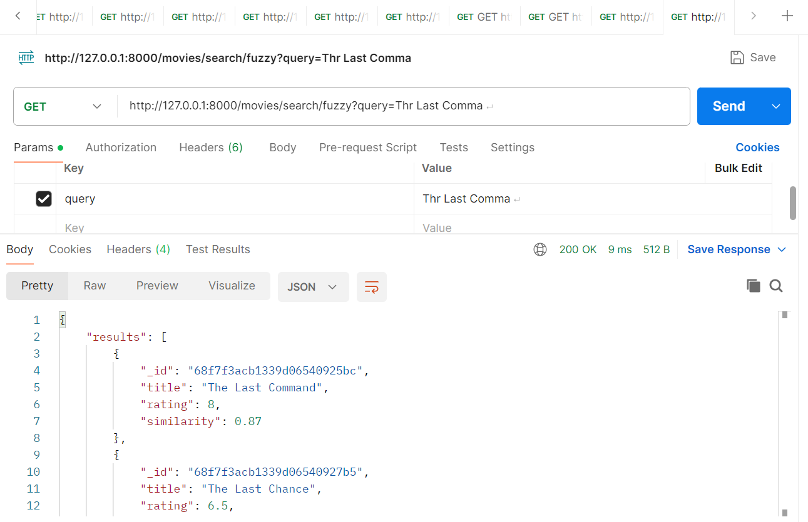
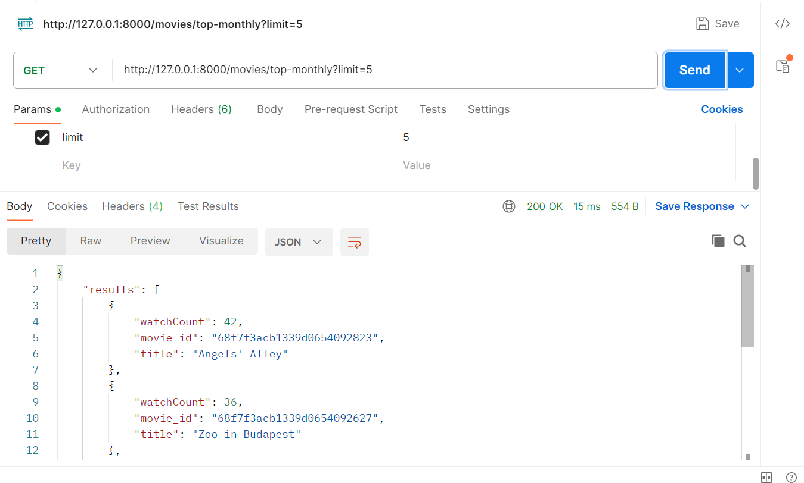
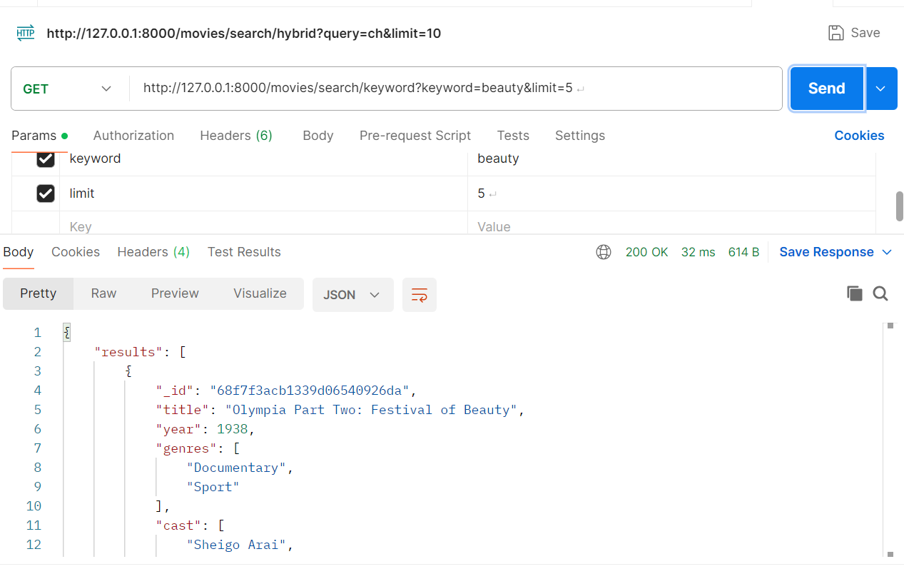

#  Movie Streaming Platform Backend

A FastAPI-powered backend for a movie streaming platform featuring intelligent search, user watch history, and movie reviews — all backed by MongoDB.


##  Features

-  **Keyword Search**: Search movies by title, director, or cast.
-  **Fuzzy Search**: Handles typos and partial matches using RapidFuzz.
-  **Hybrid Search**: Combines similarity, rating, and popularity for smarter results.
-  **User Watch History**: View what each user has watched and when.
-  **Movie Reviews**: Fetch reviews with ratings and helpful counts.
-  **Top Monthly Movies**: Aggregation query to find trending titles.
-  **Watch Counts**: See how often each movie was watched in the last 30 days.


#  Tech Stack

- **FastAPI** for API development
- **MongoDB** for data storage
- **Pydantic** for schema validation
- **RapidFuzz** for fuzzy matching
- **Uvicorn** as ASGI server

Search Implementation Note:

For this project, fuzzy and hybrid searches are performed on a subset 
of movies retrieved via keyword filtering ($regex) or by limiting candidate results 
(e.g., top 100 matches). This ensures reasonable performance for
moderately sized datasets.
In production, where the dataset could be very large, 
it is recommended to use full-text indexes, search engines (like Elasticsearch),
or other optimized techniques to handle scalability efficiently.

# MovieDB Seeding & Data Generation

This repository contains scripts to seed and populate the `movieDB` MongoDB database with sample and dynamic data.

---

## Step 1: Seed Users and Movies

**Script:** `seed_data.py`  
**Purpose:** Inserts initial users and movies into the database.  

**Usage:**
```bash

What it does:

Clears existing collections (users, movies, watchHistory, reviews).
Inserts sample users and movies.
Sets up the base data for the database.


Step 2: Generate Watch History and Reviews
Purpose: Generates random watch history and reviews for testing.

What it does:

Fetches existing users and movies from the database.
Randomly generates watch history (timestamps, duration, completion).
Randomly generates reviews with ratings and text.
Marks some movies as trending


## 📂 Folder Structure

```
movie_api/
├── db.py                 # MongoDB connection setup
├── main.py               # FastAPI app with all endpoints
├── models/               # Pydantic models and schemas
nodes_modules          
generate_data.py          # Script to seed watch history and reviews
package-lock.json         # Node.js dependency file (if used for frontend or tooling)
README.md                 # Project documentation
.venv/                    # Python virtual environment


---

## 🧪 How to Test

### 1. Start MongoDB
  
Connect db on mongo db
```

### 2. Seed the Database
```bash
python generate_data.py
```

### 3. Run the Server
```bash
uvicorn movie_api.main:app --reload
```

### 4. Test in Postman
Use these endpoints:
- `GET /movies/search/keyword?keyword=godfather`
- `GET /movies/search/fuzzy?query=godfathe`
- `GET /movies/search/hybrid?query=godfathe`
- `GET /users/{user_id}/history`
- `GET /movies/{movie_id}/reviews`
- `GET /movies/top-monthly`
- `GET /movies/watch-counts`

---

## 📌 Indexes Created

```Indexes are created in mongo db database

```

---

## API Execution Screenshots

### Hybrid Search API


### User  History API


### Movie Reviews API



### Fuzzy Search API


### Top monthly movies API


### keyword API



## ✅ Submission Checklist

- [x] All endpoints tested
- [x] Aggregation queries implemented
- [x] Indexes created
- [x] Postman screenshots taken
- [x] README completed

---

